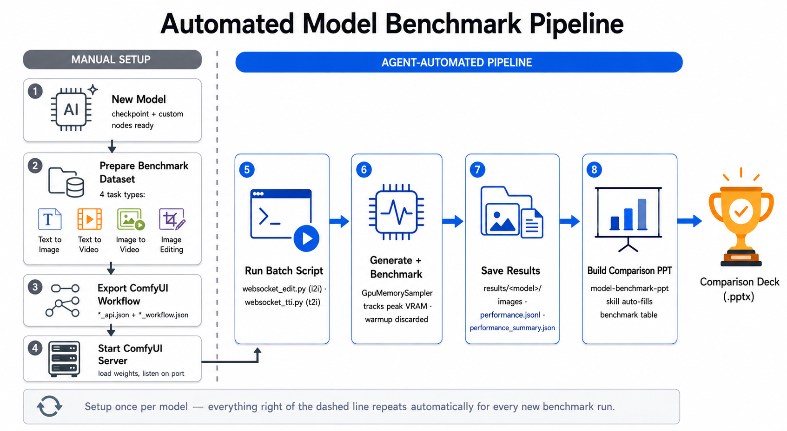

# Benchmark Testing

Batch-driving scripts for a running [ComfyUI](https://github.com/comfy-org/ComfyUI) server: queue
workflows over its websocket/HTTP API, generate images, and (in benchmark mode) measure per-request
time and peak GPU memory — then auto-build a PowerPoint comparing models against each other.



Only the left side (preparing a dataset, a ComfyUI workflow, and weights for a new model) is manual.
Everything right of the dashed line — generation, benchmarking, and the comparison deck — is driven
by the scripts in this repo and the `model-benchmark-ppt` skill, and repeats automatically for every
new benchmark run.

## Quick start

```bash
python websocket_edit.py              # i2i batch over a features-layout dataset
python websocket_tti.py               # t2i batch over one flat prompt list, N models
python websocket_tti_structured.py    # t2i batch for structured-JSON-prompt models (ideogram4)
```

Each script is configured by editing the constants in its `__main__` block (server address,
dataset path, model list, seed, etc.) — there's no CLI. See
[`CLAUDE.md`](CLAUDE.md) for the full architecture, the two benchmark-recording conventions, and
known gotchas before making changes.
